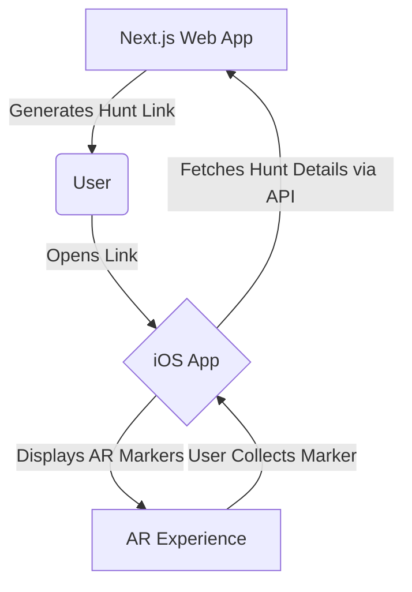

# System Patterns

_This document describes the system architecture, key technical decisions, design patterns, component relationships, and critical implementation paths._

## System Architecture

The system consists of two main components: a Next.js web application and an iOS mobile application.

## Key Technical Decisions

(What are the most important technical decisions that have been made? Why were they made?)

## Design Patterns

(What design patterns are used in this project? e.g., MVC, MVVM, Singleton, etc.)

## Component Relationships

1.  **Next.js Web App:**

    - Allows users to create and manage treasure hunts.
    - Generates a unique URL (deep link) for each hunt.
    - Provides an API endpoint for the iOS app to fetch hunt details.

2.  **iOS App:**
    - Handles the deep link to open the app and identify the specific hunt.
    - Makes an API call to the Next.js backend to get the hunt data (e.g., marker locations, 3D models).
    - Uses ARKit and RealityKit to render the AR scene and place virtual markers in the real world.
    - Manages user interaction with the AR objects (e.g., tapping to collect).

## Critical Implementation Paths

(What are the most critical parts of the system to implement? What are the dependencies?)
